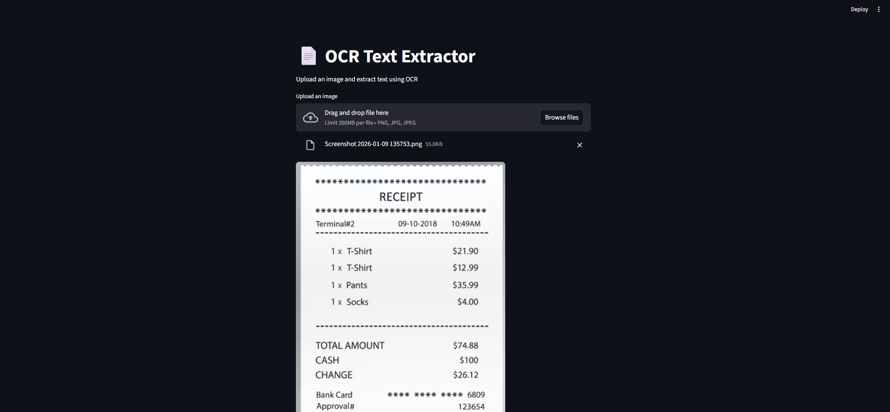
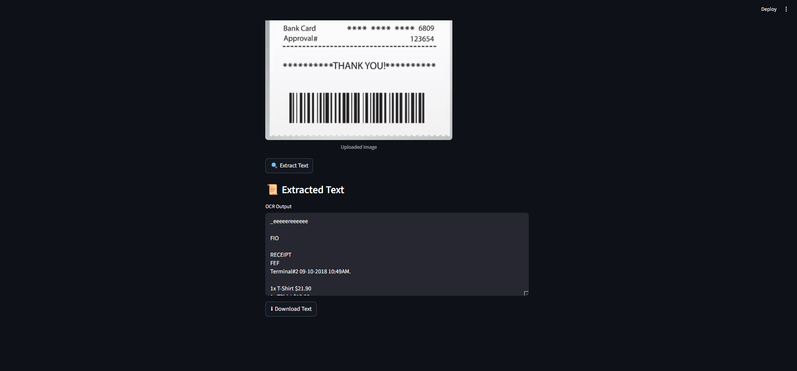

# 📄 OCR Text Extraction App

A simple **OCR-based web app** built using **Python and Streamlit** that extracts text from images using **Tesseract OCR**.

---

## 🚀 Features
- Upload image files (PNG / JPG)
- Extract text using OCR
- Simple Streamlit UI
- Download extracted text


---

## 🖼 App Output




---

## 🛠 Tech Stack
- Python
- Streamlit
- Tesseract OCR
- OpenCV
- Pillow

---

## ▶️ Run the App
```bash
streamlit run app.py

